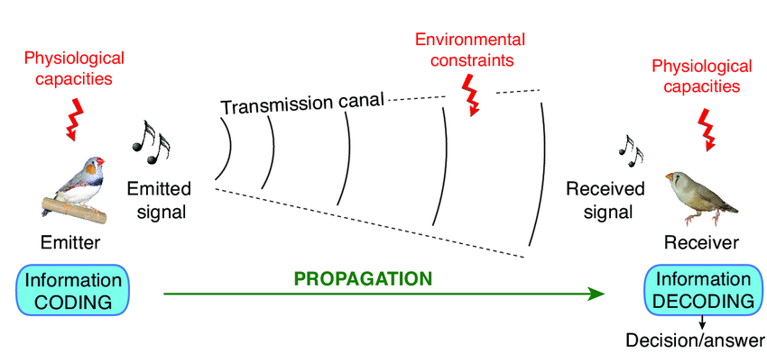

A transmission chain in telecommunications refers to the series of processes through which data travels from source to destination. It involves the conversion of data into a suitable format for transmission (encoding), modification for effective transport (modulation), and passage through a specific medium (like wire, radio waves, etc.). These signals are then demodulated and decoded at the receiver end for use.

The following video show a demo:

 <iframe width="600" height="600"
src="https://www.youtube.com/embed/VVdd_c17XKs?cc_load_policy=1" allowfullscreen>
</iframe> 

The source code:

<a href="https://github.com/SamiTechie/transmission_chain">https://github.com/SamiTechie/transmission_chain</a>
